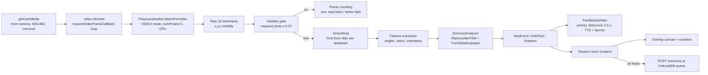
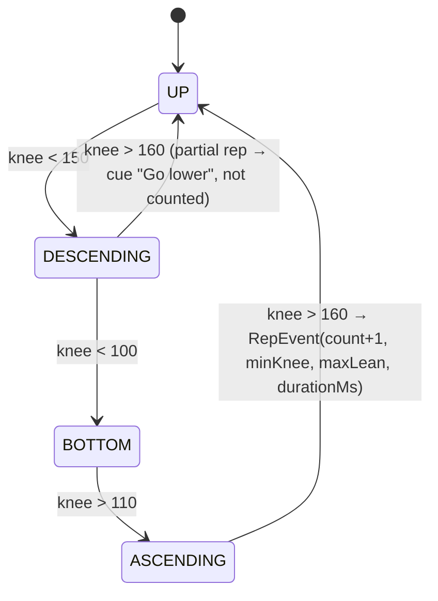
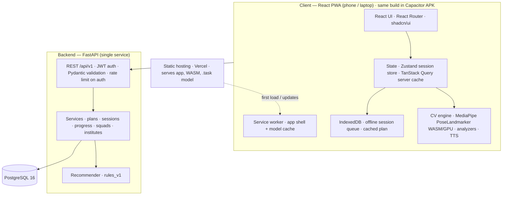
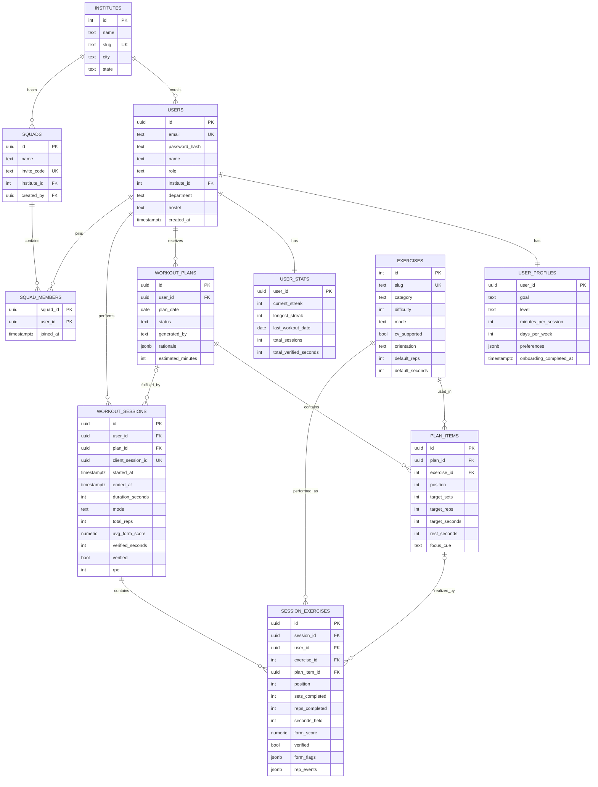
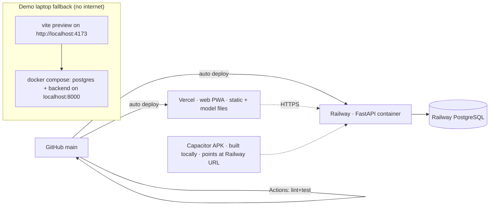

# FitSathi — Technical Blueprint

**SIH 2026 · PS 26196 · AICTE MIC Student Innovation · Theme: Fitness & Sports · Category: Software**

> **Working name:** FitSathi (*sathi* = companion). Rename freely; nothing below depends on the name.
>
> **One line:** An offline-first PWA that turns a hostel room into a coached gym — the phone camera counts reps and corrects form on-device, a rules engine adapts tomorrow's workout, and camera-verified minutes feed squad and institute leaderboards nobody can fake.
>
> **Length budget:** This document is capped at ~13,000 words. Every section is a decision plus its reason; option menus are limited to the comparison tables. Anything that needs more depth (per-exercise threshold tables, cue copy, ADRs) goes into `docs/` later, not here.

---

## 0. Your assumptions vs. my decisions (read this first)

| Your starting thought | Decision | Why |
|---|---|---|
| Mobile app | **Mobile-first PWA + Capacitor-wrapped Android APK, single React codebase** | Camera + pose runs fine in Chrome/WebView via WASM+WebGL. Zero-install for judges, laptop demo on a projector, offline via service worker, and you still ship a "real" APK. See Part 3. |
| React Native | **Rejected → React + Vite + TypeScript** | RN camera frame processing needs vision-camera frame processors + native TFLite plugin + worklets + Expo prebuild. It is the #1 way hackathon teams lose two days to build errors. The only easy RN path is a WebView running MediaPipe JS — which is the PWA with extra steps. |
| Python backend | **Kept → FastAPI + PostgreSQL** | Right choice, but not for the reason you think. No CV runs on the server. Python wins because the recommendation engine is rules/scoring logic, FastAPI gives free OpenAPI docs (judges love this), and your team knows it. |
| OpenCV for pose | **Rejected → MediaPipe Pose Landmarker (Tasks Vision JS), on-device** | OpenCV is an image-processing library, not a pose estimator. MediaPipe gives 33 landmarks with visibility scores at 15–30 fps in the browser. Video never leaves the phone. See Part 8. |
| Interactive fitness dashboard | **Shrunk for students, kept for institutes** | Students need 3 numbers and 1 chart. The "dashboard" that matters to AICTE is the institute-level Fit India participation view. |
| Personalized recommendations | **Kept → explainable rules + scoring engine, versioned for ML later** | No ML in MVP. You have zero training data. Rules that show *why* beat a black box in a 6-minute pitch. |

---

## Part 1 — Problem reinterpretation

### 1.1 What AICTE is actually asking for
The statement is a bucket, not a spec. MIC's Student Innovation track is judged on **novelty, feasibility, impact, scalability, and demo quality**. AICTE's own agenda behind it: the **Fit India Movement** push into 10,000+ technical institutions, student wellbeing, and low-cost solutions that scale across colleges. A product that shows *measurable* fitness activity at the institute level speaks directly to the sponsor.

### 1.2 Problem directions considered

| # | Direction | Verdict |
|---|---|---|
| 1 | Generic workout logger / step counter | Overdone; cheatable; no technical depth. **Reject.** |
| 2 | Nutrition + calorie platform | HealthifyMe exists; needs a food DB you can't build. **Reject.** |
| 3 | Pure AI form coach (Kemtai/Onyx clone) | Strong demo, but solves "how" not "why keep going". No India/AICTE fit alone. **Partial.** |
| 4 | Campus gamification (leaderboards, step challenges) | Addresses adherence, but trivially faked; no tech depth alone. **Partial.** |
| 5 | Sports performance analytics (bowling action, sprint) | Cool, niche, fragile to demo. **Reject for hackathon.** |
| 6 | Physio/rehab tracking | Meaningful; medical-claim risk, judges will ask for clinical validation. **Reject.** |
| 7 | Accessibility-first fitness (seated / PwD) | Meaningful; pose models degrade on seated postures; hard to get right in 10 weeks. **Post-MVP.** |
| 8 | LLM fitness chatbot | Zero defensibility; every team has one. **Reject.** |
| 9 | **Zero-equipment AI coach + campus accountability (3 + 4 fused)** | Strong demo (CV), real adherence lever (squads/institute), sponsor fit (Fit India), privacy story (on-device). **Selected.** |

### 1.3 Why #9
- **The actual problem** is not lack of exercises; it is that a student in a hostel has no coach to say "lower", no gym, no equipment, and no reason to show up on day 12. Commercial apps solve content, not correction or accountability.
- **The glue idea is "verified workouts."** Camera-counted reps make leaderboards trustworthy. That makes the CV feature *structurally* necessary rather than a gimmick — which is the argument judges need to hear.
- **It is buildable.** Rep counting for 4–5 bodyweight exercises with angle-based state machines is a known, well-trodden pattern. The risk is calibration, not research.
- **It scales for ₹0/user.** All inference is on-device; the backend stores numbers, not video.

---

## Part 2 — Product definition

| | |
|---|---|
| **Concept** | FitSathi: AI form coach for hostel-room bodyweight workouts, with an adaptive daily plan and campus-verified accountability. |
| **Target users** | Students aged 17–25 in Indian technical institutes; primary persona lives in a hostel, owns a ₹10–20k Android phone, has no gym access, and has quit at least one fitness app. Secondary: institute sports/physical-education office wanting Fit India participation numbers. |
| **User problem** | "I don't know if I'm doing it right, I have no equipment, and I stop after two weeks because nobody notices." |
| **Solution** | (1) Open app → today's 15-minute plan, with a one-line reason. (2) Prop phone against a wall → camera counts reps and speaks corrections in real time. (3) Session saved as *verified* minutes → streak, squad leaderboard, institute dashboard. (4) Tomorrow's plan adjusts from today's completion, form score, and effort. |
| **Core value proposition** | A coach that sees you, a plan that adapts to you, and a campus that notices you — with zero equipment and zero video upload. |
| **Differentiators** | On-device pose feedback (privacy + offline); verified-only leaderboards (anti-cheat); explainable adaptation ("+2 squats because…"); institute-level Fit India dashboard; installs from a link, works on ₹10k phones. |
| **Why someone uses it** | Immediate feedback is intrinsically satisfying (the counter and the voice), and a squad of 5 roommates provides the extrinsic pull. |
| **AICTE fit** | Directly operationalizes Fit India in campuses, produces institute-level metrics, costs nothing per student, and is built by students for students. |
| **Explicitly not solving** | Nutrition, weight/BMI tracking, equipment/gym workouts, running/GPS, wearables, medical/rehab, social feed/chat, video content library, payments. |

---

## Part 3 — Platform decision

### 3.1 Evaluation

| Option | Camera/pose feasibility | Demo on projector | Install friction | Offline | Team fit (JS/Python) | Verdict |
|---|---|---|---|---|---|---|
| Native Android (Kotlin + ML Kit Pose) | Best | Needs scrcpy mirroring | APK sideload | Yes | Poor (new stack) | No |
| Flutter + `google_mlkit_pose_detection` | Very good, stable plugin | scrcpy | APK | Yes | Poor (Dart) | Strong runner-up |
| React Native (Expo) | Painful: vision-camera + native TFLite plugin + worklets + prebuild | scrcpy | APK | Yes | Good | **No — integration risk** |
| Web PWA (React + MediaPipe JS) | Good: 15–30 fps on mid-range Android Chrome, 30 fps on laptop | **Native — it's a browser** | Link → Add to Home Screen | Yes (service worker) | Excellent | **Yes** |
| PWA + Capacitor APK | Same web build inside Android WebView | Both | APK + link | Yes | Excellent | **Yes (adds APK deliverable)** |

### 3.2 Decision
**Build a React + TypeScript + Vite PWA, and wrap the same build with Capacitor to produce an Android APK.** One codebase serves the student app (phone), the demo (laptop webcam on a projector), and the institute dashboard (desktop web). Rep counting needs ~10 fps; MediaPipe's GPU-delegate WASM comfortably exceeds that on Snapdragon 6xx-class phones.

**Frontend framework:** React (not Next.js — no SSR, no server components; this is a client-side camera app; Vite gives faster iteration and a simpler PWA plugin story).

**Risks and mitigations:** iOS Safari is secondary (works, but tested last). WebView camera permission in Capacitor must be verified in week 1; if it fails, the PWA remains primary and the APK is dropped without code changes.

---

## Part 4 — MVP definition

Every feature answers: *does it make the coach see you, the plan adapt, or the campus notice you?* If not, it's out.

### Must-have (hackathon MVP)
1. Email/password auth + 3-step onboarding (goal, level, minutes/day; institute + department/hostel).
2. **Today's plan** from the rules engine, with a plain-language rationale.
3. **AI Coach session**: on-device pose → rep counting + form cues (voice + on-screen) + per-rep form score for **Squat, Jumping Jack, Lunge, Push-up, Plank (hold)**.
4. **Manual mode** (tap-to-count / timer) as a first-class fallback when no camera or poor light — also the demo's safety net.
5. **Session summary** → persisted → streak + verified minutes.
6. **Progress**: streak, weekly verified minutes chart, per-exercise form-score trend.
7. **Squads**: create/join by code, weekly leaderboard on verified minutes.
8. **Institute dashboard** (web, read-only aggregates): active students, verified sessions, participation by department, weekly trend.
9. **PWA**: installable, model + app cached, sessions queue offline and sync later.

### Nice-to-have (build only if Must is done by Sprint 4)
- Hindi voice cues (Web Speech `hi-IN`).
- Rest-day / active-recovery logic in the recommender.
- Weekly institute challenge ("CSE: 10,000 verified squats").
- "Demo mode": run the pipeline on a bundled video instead of the camera (doubles as a test tool — cheap, do it early actually; see Part 25).

### Post-MVP
- 10+ exercises, yoga asana holds (pose-hold classification), high-knees/mountain-climbers.
- Institute admin role and login; department-level drill-downs; Fit India certificate export.
- Push reminders (Web Push / FCM), refresh tokens, social login.
- Contextual-bandit personalization once data exists.

### Future / advanced
- Seated/accessibility exercise pack; wearable step import; opt-in anonymized landmark upload for model improvement; iOS App Store via Capacitor.

---

## Part 5 — Screens

Fourteen screens. Navigation is bottom-tabs for the main app and a full-screen modal stack for the workout flow.

### 5.1 Navigation tree
```
App
│
├── Public
│   ├── Welcome            /                  (value prop, Install, Login/Register)
│   ├── Login              /login
│   ├── Register           /register
│   └── Campus Dashboard   /campus/:slug      (web, read-only aggregates)
│
├── Onboarding (auth required, once)          /onboarding
│   ├── Step 1  Goal & Level
│   ├── Step 2  Time & Days
│   └── Step 3  Campus (institute, dept, hostel)
│
└── Main (auth + onboarded) — bottom tabs
    ├── Home               /home
    ├── Exercises          /exercises          (library; start a free single-exercise session)
    ├── Squad              /squad
    ├── Progress           /progress
    ├── Profile            /profile
    │   └── Settings       /profile/settings
    │
    └── Workout flow (full-screen stack, no tabs)
        ├── Workout Preview     /workout/preview
        ├── Camera Setup        /workout/setup
        ├── Active Session      /workout/live      (rest timer is a state inside this screen)
        └── Session Summary     /workout/summary/:sessionId
```

### 5.2 Screen specs

**Welcome** — Purpose: convert to install/register. Sees: hero line, 3 value bullets, "Install app" (beforeinstallprompt), Login, Register. Data: none. API: none. Nav: Login/Register; if token present → Home.

**Register / Login** — Purpose: create/authenticate account. Components: email, password, name (register), submit, error toast. API: `POST /auth/register`, `POST /auth/login`. On success: store token, `GET /users/me` → if `onboarding_completed_at` null → Onboarding else Home.

**Onboarding (3 steps, one route, local wizard state)**
- Step 1: goal (General fitness / Fat loss / Strength / Just stay consistent), level (Beginner / Intermediate / Advanced) — radio cards.
- Step 2: minutes per session (10/15/20/30), days per week (3/4/5/6) — chips.
- Step 3: institute (searchable select from `GET /institutes?q=`), department (free text/select), hostel (optional).
- Submit: `PUT /users/me/profile` → then `GET /plans/today` → Home. Rationale of the first plan is shown on Home as "Your first plan".

**Home** — Purpose: one tap to today's workout. Sees: greeting + streak flame, **Today's Plan card** (exercise list with sets×reps, est. minutes, "Why this plan" expandable), primary button *Start Workout*, secondary "I'll do it without camera", weekly progress mini-bar (days done/target), squad rank chip. Data: plan, stats, squad rank. API: `GET /plans/today`, `GET /progress/summary`, `GET /squads/mine`. Actions: Start → Workout Preview; tap exercise → detail sheet. Empty/offline: cached plan from IndexedDB with "offline" badge.

**Exercises** — Purpose: library + free session. Sees: grid of exercises with badges (Camera-tracked / Timer), difficulty, muscle groups. Tap → bottom sheet: instructions, camera orientation illustration (side/front), "Start 1 set". API: `GET /exercises` (cached). Nav: → Workout Preview with an ad-hoc single-item plan.

**Workout Preview** — Purpose: confirm scope and mode before camera. Sees: ordered items, total time, toggle *Camera coach* / *Manual*, equipment note ("none"), space note ("2 m from phone, full body visible"). Actions: Start → Camera Setup (or Active Session if manual). Data: current plan in Zustand session store.

**Camera Setup** — Purpose: get a good pose signal before counting. Sees: live mirrored preview with skeleton, silhouette guide for required orientation (side for squat/lunge/push-up/plank, front for jumping jack), status chips (Lighting OK / Full body visible / Facing correct), 3-2-1 countdown when all green for 1.5 s, voice "Step back a little". Actions: Skip to manual, Switch camera, Cancel. Data: none remote. Handles permission denied → explanation + manual fallback.

**Active Session** — Purpose: the aha moment. Sees: camera feed (60% of screen) with pose overlay, giant rep counter, target reps, phase indicator (Down/Up ring), form score ring, cue banner (e.g., "Go lower"), set/exercise progress strip, pause/skip/finish. Between exercises: rest timer overlay (30 s default) with next exercise preview. Time-mode (plank): timer runs only while form is within tolerance. Manual mode: same layout, tap area replaces camera, timer for holds. Data: live `SessionState` in Zustand; per-rep events buffered in memory. API: none until finish. Finish → `POST /sessions` (or enqueue to IndexedDB if offline) → Summary.

**Session Summary** — Purpose: payoff and data quality. Sees: total reps, verified minutes, average form score, per-exercise rows (reps/target, form, top cue), streak change ("🔥 4 days"), RPE picker (1–5, one tap, saved via `PATCH /sessions/:id`), "Tomorrow's plan adjusts from this." Actions: Done → Home (refetch plan/summary), Share card (nice-to-have). Data: session response.

**Progress** — Purpose: prove the adaptation loop. Sees: streak + longest, this week vs target, 8-week bar chart of verified minutes, form-score line per exercise (select chip), session list (last 10). API: `GET /progress/summary`, `GET /sessions?limit=10`. Actions: tap session → summary (read-only).

**Squad** — Purpose: accountability. Sees: if none → Create / Join by code; else squad name, invite code (copy), weekly leaderboard (rank, name, verified minutes, sessions, form avg), "verified only" explainer tooltip, week switcher. API: `GET /squads/mine`, `GET /squads/:id/leaderboard?week=`, `POST /squads`, `POST /squads/join`. Actions: leave squad (Settings).

**Profile** — Purpose: identity + prefs. Sees: name, institute/department, goal/level/minutes (edit inline → `PUT /users/me/profile`), link to Settings, link to *my institute dashboard*. **Settings**: voice cues on/off, cue language (EN/HI), mirror camera, default mode, clear offline cache, logout, delete account (post-MVP stub).

**Campus Dashboard (`/campus/:slug`, web layout)** — Purpose: the AICTE slide, live. Sees: institute name, 4 KPI tiles (active students this week, verified sessions this week, verified minutes, avg form score), 8-week trend line, participation by department (bar, rows hidden when < 5 users for k-anonymity), top squads table. API: `GET /institutes/:slug/stats`. No auth (aggregates only). Responsive so the same route works on phone.

---

## Part 6 — User journey and the aha moment

```
Open link on phone (or install APK)
    ↓
Register (30 s) → Onboarding: goal, level, 15 min/day, institute
    ↓
Home: "Today: Squat 2×10, Jumping Jack 2×20, Lunge 2×8, Plank 2×30s (14 min)
       Why: beginner baseline; legs+cardio+core; camera-tracked so it counts as verified."
    ↓
Start → Camera Setup: prop phone, step back, chips turn green → 3-2-1
    ↓
Active Session: counter ticks on real reps only; "Go lower" on shallow ones;
                "Chest up" when leaning; voice + text; rest timer; next exercise
    ↓
Summary: 66 reps, 92 form, 14 verified minutes, 🔥 streak 1, RPE tap
    ↓
Squad: you're #2 of 5 this week (verified minutes)
    ↓
Tomorrow's Home: "Squat 2×12 (+2: you completed 2 sessions with form ≥ 85)"
```

**Aha moment:** the first time a half-rep is *not* counted and the phone says "Go lower" — the user realizes the app is watching, not just timing. Judges must experience this live within the first 90 seconds of the demo.

---

## Part 7 — Where AI/ML actually belongs

| Capability | Technique | In MVP? | Reason |
|---|---|---|---|
| Pose landmarks from camera | Pretrained pose estimation (MediaPipe) | **Yes** | The only piece that needs a neural network; using a pretrained model, no training. |
| Exercise recognition (which exercise?) | Classification | **No** | The plan already says which exercise is next. Classification adds error and no value. |
| Rep counting | Deterministic finite-state machine on joint angles with hysteresis | **Yes** | Explainable, testable, tunable per exercise. ML would need labeled data you don't have. |
| Form errors | Rule checks at specific phases (depth, torso lean, knee tracking, tempo) | **Yes** | Same reason. Rules map directly to cue strings. |
| Workout adaptation | Rules + scoring, versioned | **Yes** | Zero data at launch; judges want to hear *why*. |
| LLM | Anything | **No** | Adds latency, cost, hallucination risk, and no core value. Not even for "explain my plan" — string templates do it. |
| Predictive analytics (dropout risk) | Later, logistic regression on adherence features | **No** | Needs weeks of real usage data. Mention as roadmap. |
| Recommender ML (bandit) | Later | **No** | Log features now (`plan.rationale`, RPE, completion) so it's possible later. |

**Bottom line:** one pretrained model on-device, everything else deterministic. Say this proudly in the pitch — it's the mark of engineers, not buzzword collectors.

---

## Part 8 — Computer vision design

### 8.1 Image processing vs. pose estimation
*Image/video processing* (OpenCV) manipulates pixels: resize, threshold, background subtraction, optical flow. It cannot tell you where a knee is. *Human pose estimation* is a neural network that outputs body keypoints (x, y, optionally z and confidence) per frame. You need the second; the first is unnecessary in the browser because MediaPipe handles frame preprocessing internally.

### 8.2 Model and runtime comparison

| Option | Keypoints | Runs in browser? | Notes | Verdict |
|---|---|---|---|---|
| **MediaPipe Pose Landmarker (Tasks Vision JS)** | 33 with visibility + presence + world coords | Yes, WASM + WebGL GPU delegate | First-class JS API, `lite`/`full`/`heavy` variants (~5.5/9/29 MB), built-in single-person tracking, visibility scores enable "step back" UX | **Chosen** |
| MoveNet (TF.js) Lightning/Thunder | 17, no visibility | Yes | Very fast; fewer joints (no foot index, less robust torso), no visibility signal; TF.js bundle heavier than Tasks | Runner-up |
| YOLO-Pose / RTMPose via ONNX Runtime Web | 17 | Yes (WebGPU/WASM) | Multi-person, heavier, more integration work, no advantage for single user | No |
| OpenPose | 25 | No (server) | Dead project, GPU server | No |
| ML Kit Pose (TFLite) | 33 | Native only | Excellent, but only if going Flutter/Kotlin | No (platform decision) |
| OpenCV.js | — | Yes | Not a pose model | No |

**Model:** `pose_landmarker_lite.task` on phones, `full` on laptop (feature-flag by `navigator.hardwareConcurrency`/device memory). Self-host the `.task` file and the WASM bundle under `/public/models/` and `/public/wasm/` — never depend on Google's CDN at demo time.

**Where it runs:** 100% on-device. Nothing but derived numbers reach the backend. This is a privacy argument, an offline argument, and a cost argument (₹0 inference per user).

### 8.3 Pipeline


**Frame loop:** `video.requestVideoFrameCallback` (falls back to rAF). Skip inference if the previous call hasn't returned (no queueing). Overlay draws from the latest result independently, so UI stays at 60 fps even when inference is 15 fps.

**Landmarks used** (MediaPipe indices): nose 0; shoulders 11/12; elbows 13/14; wrists 15/16; hips 23/24; knees 25/26; ankles 27/28; heels 29/30; foot index 31/32. Angles are computed in **2D normalized image space**; `z` is too noisy for thresholds, which is why each exercise declares a required camera orientation.

### 8.4 Extensible analyzer architecture
The engine is generic; an exercise is a **declarative definition**. Adding an exercise = adding one file to `src/cv/exercises/`.

```ts
// src/cv/engine/types.ts (sketch)
export type Features = Record<string, number>;

export interface ExerciseDefinition {
  id: 'squat' | 'pushup' | 'jumping_jack' | 'lunge' | 'plank' | string;
  mode: 'reps' | 'hold';
  orientation: 'side' | 'front' | 'any';
  requiredLandmarks: number[];                   // gate on visibility
  features: Record<string, (p: Pose) => number>; // e.g. kneeAngle, torsoLean
  fsm: {
    primaryFeature: string;                      // drives phase transitions
    phases: PhaseSpec[];                         // ordered, with enter/exit thresholds (hysteresis)
    minRepDurationMs: number;                    // reject jitter double-counts
    partialRepThreshold?: number;                // "went down but not enough"
  };
  rules: FormRule[];                             // evaluated at declared phases
  holdTolerance?: { feature: string; min: number; max: number }; // hold mode only
}

export interface FormRule {
  id: string;                                    // 'depth', 'torso_lean', 'knee_valgus', 'tempo'
  phase: 'bottom' | 'top' | 'rep_complete' | 'any';
  check: (f: Features, rep: RepStats) => Violation | null;
  cue: { en: string; hi: string };
  severity: 1 | 2 | 3;                           // arbiter priority
  penalty: number;                               // form-score points
  orientation?: 'side' | 'front';                // rule only valid from this view
}
```

**Squat as the reference definition** (side view):
- Features: `kneeAngle = angle(hip, knee, ankle)` on the more-visible side; `torsoLean = angle(shoulder→hip vector, vertical)`; `hipAngle = angle(shoulder, hip, knee)`.
- FSM (hysteresis on `kneeAngle`):


- Rules: `depth` (minKnee > 100 at rep_complete → "Go lower", −25); `torso_lean` (> 45° at bottom → "Chest up", −15); `tempo` (rep < 800 ms → "Slow down", −10); `knee_valgus` (front only; knee-x spread < 0.8 × ankle-x spread → "Knees out", −15).
- Per-rep score = 100 − Σ penalties (floor 0). Exercise score = mean of rep scores. Session score = weighted by reps.

**Jumping jack** (front): primary feature = wrist-height-above-shoulder AND ankle spread ratio; phases CLOSED → OPEN → CLOSED. **Lunge** (side): front-knee angle with alternating-leg detection by which knee is forward (x offset). **Push-up** (side, phone on floor): elbow angle 160 → <90 → 160; rule: hip sag (shoulder–hip–ankle angle < 160 → "Hips up"). **Plank** (hold): timer accumulates while `shoulder–hip–ankle` in [165°, 185°] and visibility OK; pauses otherwise with "Hips up/down".

### 8.5 Robustness handling

| Problem | Handling |
|---|---|
| Poor lighting | Mean visibility of required landmarks < 0.5 for > 1 s → pause counting, banner "Move to better light". Setup screen refuses to start until green. |
| Camera angle | Each exercise declares orientation; setup checks facing via shoulder-width/hip-width pixel ratio (side view → ratio small) and shows the matching silhouette. Rules carry an `orientation` tag and are skipped if the view doesn't match. |
| Multiple people | `numPoses: 1` — the model tracks the most prominent person. Setup screen shows a framing box; the user is told to be alone in frame. Post-MVP: choose the largest bbox nearest the previous frame. |
| Missing landmarks | Hold last valid value ≤ 5 frames; beyond that, FSM freezes in current phase (no counting) until visibility returns. Never count during a gap. |
| Jitter / noise | One-Euro filter on landmark coordinates (min cutoff 1.0, beta 0.01), hysteresis gaps ≥ 10° between enter/exit thresholds, `minRepDurationMs` (600–800), minimum 3 consecutive frames to confirm a phase change. |
| Different body types / phones | Thresholds are per-exercise constants in the definition, calibrated on ≥ 10 people during Sprint 4; setup screen normalizes by torso length so pixel-based rules are scale-invariant. |
| Low fps devices | Adaptive: if inference > 120 ms, downscale video to 480×360 and switch to `lite`. Counting works down to ~8 fps. |

### 8.6 Feedback generation
`FeedbackArbiter` receives violations and rep events; picks the highest-severity violation in the last rep; speaks at most one cue per 2.5 s via `speechSynthesis` (voice: `en-IN`/`hi-IN` if available); always shows the text banner; announces every 5th rep ("five", "ten") and set completion. Positive reinforcement when 3 consecutive clean reps ("Good depth").

---

## Part 9 — Recommendation engine

**Does the product need personalization?** Yes, but narrowly: the plan must visibly change based on what the camera saw. That closes the loop between the two halves of the product. Anything beyond that is noise.

**Approach:** deterministic rules + scoring, `generated_by = "rules_v1"`, rationale stored as structured JSON so you can (a) render "why" text, (b) train a bandit later.

**Inputs:** profile (goal, level, minutes, days/week); catalog (exercises with category, difficulty, cv_supported); history (last 14 days: sessions, completion ratio, per-exercise form score, RPE, consecutive training days); today's date.

**Algorithm (`backend/app/recommender/engine.py`):**
1. **Template** from minutes: 10 → warm-up 1 + 3 exercises × 2 sets; 15 → 1 + 4 × 2; 20 → 1 + 4 × 3; 30 → 1 + 5 × 3. Rest 30 s (beginner 45 s).
2. **Category composition** by goal: general `{legs, cardio, core, push}`; fat_loss `{cardio, cardio, legs, core}`; strength `{legs, push, push, core}`; consistency = general with ×0.8 volume and `cv_supported` weighted higher.
3. **Candidate scoring per slot:** `score = 10 − 3·|difficulty − levelIndex| − 4·usedYesterday − 2·usedDayBefore + 2·cv_supported + 1.5·(formScore < 70 ? 1 : 0)` — the last term deliberately *keeps* a weak exercise and attaches a `focus_cue` (e.g., "Focus: depth") rather than removing it. Ties broken by a seeded RNG (seed = user_id + date) so the plan is stable within a day.
4. **Volume progression** on base reps by level (beginner 8/intermediate 12/advanced 15; holds 20/30/45 s): last 2 sessions completed with avg form ≥ 80 and RPE ≤ 3 → ×1.10 (cap +2 reps/day); RPE 5 or last session < 60% complete → ×0.85; form < 60 → ×0.90 + focus cue; ≥ 3 missed days → reset to base ("welcome back").
5. **Recovery rule** (nice-to-have): 3 consecutive training days → today is mobility + plank only.
6. **Rationale**: list of `{code, params}` such as `{"code":"progress_reps","exercise":"squat","delta":2,"reason":"2 sessions form≥85"}` rendered to strings on the client (localizable).

**Evolution path:** keep the interface `generate(profile, history, catalog, date) -> Plan`. `rules_v2` can add per-exercise fatigue; an ML policy can later reorder candidates while rules keep safety bounds.

---

## Part 10 — System architecture

### 10.1 MVP architecture


Components and MVP choices:
- **Frontend:** React PWA; all CV local; offline queue.
- **Backend:** one FastAPI process; no workers, no queue, no Redis.
- **API:** REST + JSON; OpenAPI auto-docs at `/docs` (show judges).
- **Database:** single Postgres; weekly leaderboards computed by query (fine to ~10k users).
- **Auth:** JWT (HS256, 7-day access token) issued by FastAPI; argon2 password hashing.
- **AI/ML/CV:** on-device only; backend stores derived metrics.
- **Storage:** none. No video, no images. Ever.
- **Cache:** TanStack Query on the client; Postgres is fast enough server-side.
- **Background processing:** none; `user_stats` updated synchronously on session save.
- **Notifications:** none.
- **Analytics:** none beyond DB (Progress and Campus pages are the analytics).
- **Monitoring:** structured JSON logs + `/health`. Sentry only if free tier setup takes < 30 min.

### 10.2 Production-scale differences (not built now)
Redis for leaderboard/stat caching and rate limiting; a worker (Celery/Arq) for weekly aggregates, streak resets, push notifications; refresh tokens + rotation; institute admin roles/RBAC; read replica or materialized views for institute stats; object storage only for opt-in landmark-sequence uploads (never raw video) for model improvement; CDN for model files; Sentry + OpenTelemetry; feature flags; horizontal scaling behind a managed load balancer; DB partitioning of `session_exercises` by month.

---

## Part 11 — Technology stack (definitive)

| Layer | Choice | Reason |
|---|---|---|
| Frontend | **React 19 + TypeScript + Vite** | Team knows React; Vite fast; no SSR needed. |
| PWA | **vite-plugin-pwa (Workbox)** | Precache app shell + model files with one config block. |
| Native wrapper | **Capacitor 7 (Android)** | APK deliverable from the same build; camera works in WebView. |
| UI | **Tailwind CSS 4 + shadcn/ui** | Fast, accessible, consistent; no design-system bikeshedding. |
| Routing | **React Router 7** | Standard; nested layouts for tabs vs. workout stack. |
| Server state | **TanStack Query 5** | Caching, refetch, offline-aware mutations. |
| Client state | **Zustand 5** | Tiny; perfect for the high-frequency session store the CV loop writes to. |
| Charts | **Recharts** | Enough for bars/lines; small. |
| CV | **@mediapipe/tasks-vision (PoseLandmarker)** | See Part 8. |
| Filtering | Hand-written One-Euro filter (~60 lines) | No dependency needed. |
| TTS | Web Speech API `speechSynthesis` | Built in; EN-IN/HI-IN voices on Android. |
| Local storage | **IndexedDB via `idb-keyval`** (queue, cached plan) + `localStorage` (token, prefs) | Simple; no ORM needed. |
| API client | `fetch` wrapper + types generated from OpenAPI via `openapi-typescript` | One source of truth for DTOs. |
| Backend | **FastAPI 0.115+ on Python 3.12, uvicorn** | Pydantic v2 validation, OpenAPI docs, async where useful. |
| ORM / migrations | **SQLAlchemy 2.0 (sync) + psycopg 3 + Alembic** | Sync avoids async lazy-load footguns (`MissingGreenlet`) that eat hackathon hours; FastAPI runs sync endpoints in a threadpool — zero throughput concern at this scale. |
| Auth | **PyJWT + pwdlib[argon2]** | Maintained libs; no python-jose/passlib. |
| Rate limiting | **slowapi** on `/auth/*` | One decorator. |
| Package mgmt | **uv** (Python), **pnpm** (Node) | Fast, lockfiles. |
| Database | **PostgreSQL 16** (Railway managed; Docker locally) | Relational data, JSONB for rep events/rationale. |
| Deployment | **Vercel** (web), **Railway** (API + Postgres), **docker-compose** locally | Auto-deploy from `main`; Railway doesn't cold-start like Render free tier. |
| CI | **GitHub Actions** | Lint, typecheck, tests, build on PR. |
| Testing | **pytest + httpx**; **Vitest**; **Playwright** | See Part 21. |
| Lint/format | **ruff**; **ESLint + Prettier** | Standard. |
| Monitoring | Structured logs; Sentry optional | Not worth more in MVP. |

Not chosen and why: Next.js (no SSR need), Supabase/Firebase auth (own backend is more credible in the pitch and keeps recommender in Python), Redis (nothing to cache yet), Docker for the frontend (static hosting is simpler), Flutter (Dart learning curve for this team), React Native (Part 3).

---

## Part 12 — Database design

### 12.1 Entities

| Table | Purpose | Key fields | Keys / indexes |
|---|---|---|---|
| `institutes` | AICTE institutes for campus grouping | `id`, `name`, `slug` (unique), `city`, `state`, `aicte_code` (nullable) | PK `id`; unique `slug` |
| `users` | Auth identity | `id` (uuid), `email` (unique), `password_hash`, `name`, `role` (`student`/`institute_admin`), `institute_id` FK, `department`, `hostel`, `created_at` | PK; unique `email`; idx `institute_id` |
| `user_profiles` | Fitness preferences (1:1) | `user_id` PK/FK, `goal` enum, `level` enum, `minutes_per_session`, `days_per_week`, `preferences` jsonb (voice, language, mirror), `onboarding_completed_at` | PK `user_id` |
| `exercises` | Catalog (seeded) | `id`, `slug` (unique), `name`, `category` enum (`legs`,`push`,`core`,`cardio`,`mobility`), `difficulty` 1–3, `mode` (`reps`/`hold`), `cv_supported` bool, `orientation` (`side`/`front`/`any`), `default_reps`, `default_seconds`, `instructions`, `muscle_groups` text[], `cv_config_version` | PK; unique `slug` |
| `workout_plans` | One generated plan per user per day | `id`, `user_id` FK, `plan_date`, `status` (`pending`/`in_progress`/`completed`/`skipped`), `generated_by`, `rationale` jsonb, `estimated_minutes`, `created_at` | PK; **unique (`user_id`,`plan_date`)** |
| `plan_items` | Exercises within a plan | `id`, `plan_id` FK, `exercise_id` FK, `position`, `target_sets`, `target_reps`, `target_seconds`, `rest_seconds`, `focus_cue` | PK; idx `plan_id` |
| `workout_sessions` | A performed workout | `id`, `user_id` FK, `plan_id` FK nullable, `client_session_id` uuid (unique, idempotency), `started_at`, `ended_at`, `duration_seconds`, `mode` (`cv`/`manual`/`mixed`), `total_reps`, `avg_form_score`, `verified_seconds`, `verified` bool, `rpe` smallint nullable, `device_info` jsonb | PK; unique `client_session_id`; idx (`user_id`,`started_at` desc); idx (`started_at`) for weekly aggregates |
| `session_exercises` | Per-exercise results in a session | `id`, `session_id` FK, `user_id` FK (denormalized for trend queries), `exercise_id` FK, `plan_item_id` FK nullable, `position`, `sets_completed`, `reps_completed`, `seconds_held`, `form_score`, `verified` bool, `form_flags` jsonb (`{"depth":3,"torso_lean":1}`), `rep_events` jsonb (compact array `[t_ms, score, minAngle, durMs]`) | PK; idx `session_id`; idx (`user_id`,`exercise_id`,`created_at`) |
| `user_stats` | Denormalized cache | `user_id` PK/FK, `current_streak`, `longest_streak`, `last_workout_date`, `total_sessions`, `total_verified_seconds`, `updated_at` | PK |
| `squads` | Accountability groups | `id`, `name`, `invite_code` (unique, 6 chars), `institute_id` FK, `created_by` FK, `created_at` | PK; unique `invite_code` |
| `squad_members` | Membership | `squad_id` FK, `user_id` FK, `joined_at` | PK (`squad_id`,`user_id`); idx `user_id` |

Deliberately absent: refresh tokens, challenges, notifications, body metrics (height/weight — unnecessary for bodyweight plans and invites BMI creep), media.

### 12.2 ER diagram


**Verified definition (single source of truth in `session_service.py`):** a `session_exercise` is verified if `mode == cv` and `reps_completed ≥ 0.6 × target` (or `seconds_held ≥ 0.6 × target`) with mean landmark visibility ≥ 0.6 (client reports it). A session's `verified_seconds` = Σ duration of verified exercises; `verified = verified_seconds ≥ 0.5 × duration_seconds`. Leaderboards and institute stats count **only** `verified_seconds`.

---

## Part 13 — Backend architecture

```
backend/
├── app/
│   ├── main.py                    # create_app(): routers, CORS, exception handlers, /health
│   ├── core/
│   │   ├── config.py              # pydantic-settings: DATABASE_URL, JWT_SECRET, CORS_ORIGINS
│   │   ├── database.py            # engine, SessionLocal, get_db dependency
│   │   ├── security.py            # hash/verify password, create/decode JWT
│   │   ├── logging.py             # structured JSON logging
│   │   └── exceptions.py          # AppError → uniform {"error": {code, message}} envelope
│   ├── api/
│   │   ├── deps.py                # get_current_user, get_db
│   │   ├── router.py              # mounts v1 routers under /api/v1
│   │   └── v1/
│   │       ├── auth.py            # register, login
│   │       ├── users.py           # me, profile
│   │       ├── institutes.py      # search, stats
│   │       ├── exercises.py       # catalog
│   │       ├── plans.py           # today, regenerate
│   │       ├── sessions.py        # create, list, get, patch rpe
│   │       ├── progress.py        # summary
│   │       └── squads.py          # create, join, mine, leaderboard
│   ├── models/                    # SQLAlchemy ORM — one file per aggregate
│   │   ├── base.py  user.py  profile.py  institute.py  exercise.py
│   │   ├── plan.py  session.py  stats.py  squad.py
│   ├── schemas/                   # Pydantic request/response DTOs — mirror api/v1 files
│   │   ├── auth.py  user.py  institute.py  exercise.py  plan.py
│   │   ├── session.py  progress.py  squad.py  common.py
│   ├── services/                  # business logic; the only layer that touches the DB
│   │   ├── auth_service.py
│   │   ├── plan_service.py        # get_or_generate_today() → calls recommender
│   │   ├── session_service.py     # idempotent save, verified calc, stats + streak update
│   │   ├── progress_service.py    # weekly minutes, form trends
│   │   ├── squad_service.py       # invite codes, leaderboard query
│   │   └── institute_service.py   # aggregates with k-anonymity threshold
│   ├── recommender/               # pure Python, no DB imports — fully unit-testable
│   │   ├── types.py               # ProfileInput, HistoryInput, PlanOutput, Rationale
│   │   ├── catalog.py             # category composition, base volumes per level
│   │   ├── templates.py           # minutes → slots/sets/rest
│   │   ├── scoring.py             # candidate scoring
│   │   ├── progression.py         # volume multipliers from history
│   │   ├── engine.py              # generate(profile, history, catalog, date) -> PlanOutput
│   │   └── explain.py             # rationale codes (rendered client-side)
│   └── utils/
│       ├── dates.py               # ISO week helpers (Mon–Sun), IST handling
│       └── codes.py               # invite code generator
├── alembic/
│   ├── env.py
│   └── versions/
├── seeds/
│   ├── exercises.json             # catalog incl. cv thresholds version
│   ├── institutes.csv             # AICTE institute subset (name, slug, city, state)
│   └── seed.py                    # idempotent seeding
├── scripts/
│   └── demo_data.py               # 5 users, 1 squad, 3 weeks of sessions → demo dashboard
├── tests/
│   ├── conftest.py                # test DB, client fixture, auth helper
│   ├── test_auth.py  test_plans.py  test_sessions.py  test_squads.py  test_institutes.py
│   └── recommender/
│       ├── test_engine.py  test_progression.py  test_scoring.py
├── pyproject.toml   alembic.ini   Dockerfile   .env.example   README.md
```

**Responsibilities and rules:**
- `api/v1/*`: parse/validate → call one service function → return schema. No SQL, no business rules.
- `services/*`: transactions, invariants (idempotency, verified calc, streak), the only place that imports `models`.
- `recommender/*`: pure functions over plain dataclasses. **Must never import SQLAlchemy.** This is what makes it testable and swappable.
- `models/*` vs `schemas/*`: ORM entities vs. wire DTOs. Never return ORM objects from endpoints.
- No repository layer, no dependency-injection framework, no CQRS. YAGNI.

---

## Part 14 — Frontend architecture

Feature-based folders; the CV engine is a **framework-free TypeScript library** under `src/cv/` with no React imports, so it can be unit-tested with fixtures and reused in a future native shell.

```
web/
├── public/
│   ├── manifest.webmanifest  icons/
│   ├── models/pose_landmarker_lite.task  models/pose_landmarker_full.task
│   ├── wasm/                       # @mediapipe/tasks-vision wasm bundle (self-hosted)
│   └── demo/squat_demo.mp4         # demo-mode video (also a test fixture source)
├── src/
│   ├── main.tsx  App.tsx  router.tsx
│   ├── app/
│   │   ├── providers.tsx           # QueryClient, Router, Toaster
│   │   ├── queryClient.ts
│   │   └── guards.tsx              # RequireAuth, RequireOnboarded
│   ├── features/
│   │   ├── auth/         pages/LoginPage.tsx RegisterPage.tsx WelcomePage.tsx  api.ts  authStore.ts
│   │   ├── onboarding/   OnboardingPage.tsx  steps/GoalStep.tsx TimeStep.tsx CampusStep.tsx  api.ts
│   │   ├── home/         HomePage.tsx  components/TodayPlanCard.tsx StreakBadge.tsx PlanRationale.tsx
│   │   ├── exercises/    ExercisesPage.tsx  ExerciseSheet.tsx  api.ts
│   │   ├── workout/
│   │   │   ├── pages/WorkoutPreviewPage.tsx CameraSetupPage.tsx ActiveSessionPage.tsx SessionSummaryPage.tsx
│   │   │   ├── store/sessionStore.ts        # Zustand: plan items, current item/set, reps, cues, events
│   │   │   ├── hooks/useWorkoutRunner.ts    # orchestrates camera → cv engine → store
│   │   │   ├── hooks/useRestTimer.ts  hooks/useManualCounter.ts
│   │   │   ├── components/PoseOverlay.tsx RepCounter.tsx CueBanner.tsx PhaseRing.tsx
│   │   │   │               FormScoreRing.tsx RestOverlay.tsx SetupChecklist.tsx SilhouetteGuide.tsx
│   │   │   ├── sync/offlineQueue.ts         # IndexedDB queue + flush on reconnect
│   │   │   └── api.ts                        # POST /sessions, PATCH rpe
│   │   ├── progress/     ProgressPage.tsx  charts/WeeklyMinutesChart.tsx FormTrendChart.tsx  api.ts
│   │   ├── squad/        SquadPage.tsx  JoinCreateSheet.tsx  Leaderboard.tsx  api.ts
│   │   ├── profile/      ProfilePage.tsx  SettingsPage.tsx  api.ts
│   │   └── campus/       CampusDashboardPage.tsx  components/KpiTile.tsx DeptBar.tsx  api.ts
│   ├── cv/                          # NO React imports anywhere in here
│   │   ├── pose/PoseDetector.ts     # MediaPipe wrapper: init, detect(video, ts), dispose, model choice
│   │   ├── pose/landmarks.ts        # index constants, Pose type
│   │   ├── filters/oneEuro.ts  filters/visibilityGate.ts
│   │   ├── geometry/angles.ts  geometry/orientation.ts  geometry/normalize.ts
│   │   ├── engine/types.ts  RepCounterFSM.ts  HoldTimer.ts  FormRuleEvaluator.ts
│   │   │           ExerciseAnalyzer.ts  FeedbackArbiter.ts  scoring.ts
│   │   ├── exercises/squat.ts  jumpingJack.ts  lunge.ts  pushup.ts  plank.ts  index.ts (registry)
│   │   ├── feedback/tts.ts  cueCatalog.ts
│   │   └── sources/CameraSource.ts  VideoFileSource.ts   # same interface: camera or demo video
│   ├── components/ui/               # shadcn generated
│   ├── components/layout/AppShell.tsx BottomTabs.tsx PageHeader.tsx
│   ├── lib/apiClient.ts  storage.ts  env.ts  format.ts  pwa.ts  week.ts
│   ├── hooks/useCamera.ts  useOnlineStatus.ts  useInstallPrompt.ts
│   ├── types/api.d.ts               # generated by openapi-typescript from backend /openapi.json
│   └── styles/globals.css
├── tests/
│   ├── unit/cv/                     # Vitest: fixtures/*.json landmark sequences → expected reps
│   ├── unit/components/
│   └── e2e/                         # Playwright: register → onboard → manual session → summary
├── capacitor.config.ts  android/ (generated, committed)
├── index.html  vite.config.ts  tailwind.config.ts  tsconfig.json  package.json  .env.example
```

**Rules:** `features/*` may import `cv/`, `lib/`, `components/`; `cv/` imports nothing from `features/` or React. High-frequency CV output writes to the Zustand store; React components subscribe to slices (`useSessionStore(s => s.reps)`) so only counters re-render, not the whole page. Overlay drawing is imperative on a `<canvas>` via `requestAnimationFrame`, not React state.

---

## Part 15 — Repository structure

```
fitsathi/
├── web/                      # React PWA + Capacitor (Part 14)
├── backend/                  # FastAPI (Part 13)
├── docs/
│   ├── BLUEPRINT.md          # this file
│   ├── api.md                # generated from OpenAPI + examples
│   ├── cv-exercise-authoring.md   # how to add an exercise + calibration protocol
│   ├── demo-script.md        # Part 25, with timings and fallbacks
│   └── adr/                  # 0001-pwa-over-rn.md, 0002-on-device-cv.md, 0003-rules-recommender.md
├── .github/workflows/
│   ├── backend.yml           # ruff, pytest (Postgres service container)
│   └── web.yml               # eslint, tsc, vitest, build
├── docker-compose.yml        # postgres + backend for local dev and demo fallback
├── Makefile                  # make dev / make seed / make demo-data / make test
├── README.md  LICENSE  .gitignore  .editorconfig
```
No `admin/` (dashboard is a route in `web/`), no `ml/` (no training), no `infrastructure/` (two PaaS dashboards), no root `tests/` (tests live with their code).

---

## Part 16 — Building blocks: dependencies and boundaries

| Module | Does | Depends on | Depended on by | Put here | Never put here |
|---|---|---|---|---|---|
| `web/src/cv/pose` | Model load, per-frame inference, source abstraction (camera/video) | `@mediapipe/tasks-vision` | `engine`, `useWorkoutRunner` | Model selection, wasm paths, timestamps | Exercise logic, UI |
| `web/src/cv/engine` | Generic FSM, hold timer, rule evaluation, scoring, cue arbitration | `geometry`, `filters`, `types` | `exercises`, `useWorkoutRunner` | Threshold hysteresis, rep events | Exercise-specific numbers |
| `web/src/cv/exercises` | Declarative definitions + thresholds | `engine/types`, `geometry` | `engine` registry | One file per exercise | Any DOM or React |
| `web/src/features/workout` | Screens, session store, runner hook, offline queue | `cv`, `lib/apiClient`, `components` | Router | Session lifecycle, UI | Angle math |
| `web/src/lib/apiClient` | Auth header, error envelope, retries | `authStore` | All `features/*/api.ts` | Base URL, 401 handling | Feature-specific calls |
| `backend/app/recommender` | Plan generation | stdlib only | `plan_service` | Rules, scoring, rationale codes | SQLAlchemy, FastAPI |
| `backend/app/services` | Transactions, invariants | `models`, `recommender` | `api/v1` | Verified calc, streak, idempotency | HTTP concerns |
| `backend/app/api/v1` | HTTP mapping | `schemas`, `services`, `deps` | `main` | Status codes, auth deps | SQL, business rules |
| `backend/seeds` | Catalog and institutes | `models` | `make seed`, tests | Exercise catalog truth | User data |

---

## Part 17 — API design

Base path `/api/v1`. Auth: `Authorization: Bearer <jwt>` unless marked public. Errors: `{"error": {"code": "string", "message": "string"}}`.

| Method | Route | Purpose | Auth |
|---|---|---|---|
| POST | `/auth/register` | Create account, return token | public (rate-limited) |
| POST | `/auth/login` | Return token | public (rate-limited) |
| GET | `/users/me` | Profile + stats + onboarding status | user |
| PUT | `/users/me/profile` | Create/update profile (onboarding) | user |
| GET | `/institutes?q=` | Search institutes | public |
| GET | `/institutes/{slug}/stats?weeks=8` | Aggregates for campus dashboard | public |
| GET | `/exercises` | Catalog | user |
| GET | `/plans/today` | Get or generate today's plan | user |
| POST | `/plans/today/regenerate` | Regenerate with a different seed (nice-to-have) | user |
| POST | `/sessions` | Save a completed session (idempotent) | user |
| PATCH | `/sessions/{id}` | Set RPE | user (owner) |
| GET | `/sessions?limit=10&cursor=` | Recent sessions | user |
| GET | `/sessions/{id}` | Session detail | user (owner) |
| GET | `/progress/summary` | Streak, weekly minutes (8 wks), form trend | user |
| POST | `/squads` | Create squad | user |
| POST | `/squads/join` | Join by invite code | user |
| GET | `/squads/mine` | My squad (or null) | user |
| GET | `/squads/{id}/leaderboard?week=2026-W47` | Weekly verified-minutes ranking | member |
| GET | `/health` | Liveness | public |

**Examples**

`POST /auth/register`
```json
// request
{ "email": "asha@nitk.edu.in", "password": "••••••••", "name": "Asha" }
// 201
{ "access_token": "eyJ...", "token_type": "bearer",
  "user": { "id": "5f1c...", "email": "asha@nitk.edu.in", "name": "Asha", "onboarding_completed": false } }
```

`PUT /users/me/profile`
```json
{ "goal": "general", "level": "beginner", "minutes_per_session": 15, "days_per_week": 4,
  "institute_id": 118, "department": "CSE", "hostel": "Block C",
  "preferences": { "voice": true, "language": "en", "mirror": true } }
```

`GET /plans/today`
```json
{ "id": "a1b2...", "plan_date": "2026-11-20", "status": "pending", "estimated_minutes": 14,
  "generated_by": "rules_v1",
  "items": [
    { "id": "i1", "position": 1, "exercise": { "id": 7, "slug": "march_in_place", "name": "March in place", "mode": "hold", "cv_supported": false },
      "target_sets": 1, "target_seconds": 60, "rest_seconds": 15 },
    { "id": "i2", "position": 2, "exercise": { "id": 1, "slug": "squat", "name": "Squat", "mode": "reps", "cv_supported": true, "orientation": "side" },
      "target_sets": 2, "target_reps": 12, "rest_seconds": 30, "focus_cue": "depth" },
    { "id": "i3", "position": 3, "exercise": { "id": 3, "slug": "jumping_jack", "name": "Jumping Jack", "mode": "reps", "cv_supported": true, "orientation": "front" },
      "target_sets": 2, "target_reps": 20, "rest_seconds": 30 },
    { "id": "i4", "position": 4, "exercise": { "id": 5, "slug": "plank", "name": "Plank", "mode": "hold", "cv_supported": true, "orientation": "side" },
      "target_sets": 2, "target_seconds": 30, "rest_seconds": 30 }
  ],
  "rationale": [
    { "code": "composition", "goal": "general", "categories": ["mobility", "legs", "cardio", "core"] },
    { "code": "progress_reps", "exercise": "squat", "delta": 2, "reason": "two_sessions_form_ge_85" },
    { "code": "focus_cue", "exercise": "squat", "rule": "depth", "last_form": 68 }
  ]
}
```

`POST /sessions`
```json
// request (client builds this from the Zustand store)
{ "client_session_id": "0c9e...-uuid", "plan_id": "a1b2...", "mode": "cv",
  "started_at": "2026-11-20T07:02:11+05:30", "ended_at": "2026-11-20T07:16:40+05:30",
  "device_info": { "ua": "Chrome/130 Android", "model": "lite", "avg_fps": 17 },
  "exercises": [
    { "exercise_id": 1, "plan_item_id": "i2", "position": 2, "mode": "cv", "sets_completed": 2, "reps_completed": 22,
      "target_reps": 24, "duration_seconds": 150, "form_score": 88.5, "mean_visibility": 0.83,
      "form_flags": { "depth": 2, "torso_lean": 1 },
      "rep_events": [[1200, 100, 92, 1450], [2900, 75, 108, 1300]] },
    { "exercise_id": 5, "plan_item_id": "i4", "position": 4, "mode": "cv", "sets_completed": 2, "seconds_held": 58,
      "target_seconds": 60, "duration_seconds": 95, "form_score": 94, "mean_visibility": 0.79, "form_flags": { "hip_sag": 1 } }
  ] }
// 201
{ "id": "s77...", "total_reps": 66, "avg_form_score": 90.1, "duration_seconds": 869, "verified_seconds": 610, "verified": true,
  "streak": { "current": 4, "longest": 4, "changed": true }, "plan_status": "completed" }
```

`GET /squads/{id}/leaderboard?week=2026-W47`
```json
{ "squad": { "id": "q1", "name": "Block C Beasts", "invite_code": "K7P2QD" }, "week": "2026-W47",
  "rows": [ { "rank": 1, "user_id": "u2", "name": "Rahul", "verified_minutes": 62, "sessions": 4, "avg_form": 91 },
            { "rank": 2, "user_id": "u1", "name": "Asha", "verified_minutes": 48, "sessions": 3, "avg_form": 88, "is_me": true } ] }
```

`GET /institutes/nitk/stats?weeks=8`
```json
{ "institute": { "name": "NIT Karnataka", "slug": "nitk" },
  "this_week": { "active_students": 142, "verified_sessions": 388, "verified_minutes": 5120, "avg_form_score": 86.2 },
  "trend": [ { "week": "2026-W40", "active_students": 31, "verified_minutes": 900 }, { "week": "2026-W41", "active_students": 58, "verified_minutes": 1780 } ],
  "by_department": [ { "department": "CSE", "active_students": 61, "verified_minutes": 2210 }, { "department": "ECE", "active_students": 40, "verified_minutes": 1400 } ],
  "top_squads": [ { "name": "Block C Beasts", "members": 5, "verified_minutes": 310 } ],
  "k_anonymity_threshold": 5 }
```

---

## Part 18 — State and data flow

### 18.1 Standard request path
```mermaid
sequenceDiagram
  participant U as User
  participant UI as React screen
  participant Q as TanStack Query
  participant API as FastAPI /api/v1
  participant S as Service
  participant DB as Postgres
  U->>UI: Open Home
  UI->>Q: useQuery(['plan','today'])
  Q->>API: GET /plans/today (Bearer)
  API->>S: plan_service.get_or_generate_today(user)
  S->>DB: SELECT plan WHERE user_id, plan_date
  alt none
    S->>S: recommender.generate(profile, history, catalog, today)
    S->>DB: INSERT plan + items
  end
  S-->>API: PlanOut
  API-->>Q: 200 JSON
  Q-->>UI: render; cache 5 min; persist to IndexedDB for offline
```

### 18.2 CV session path (all local until the end)
```
Camera / demo video
  ↓ frame (≈15–30 fps)
PoseDetector.detect() → 33 landmarks
  ↓
visibilityGate → oneEuro → features (angles)
  ↓
ExerciseAnalyzer(definition).update(features, tMs)
  ↓ RepEvent | HoldTick | Violation | PhaseChange
sessionStore (Zustand): reps, phase, score, cues, repEvents[]
  ↓ subscribed slices
RepCounter / PhaseRing / CueBanner re-render; FeedbackArbiter speaks
  ↓ on "Finish"
buildSessionPayload(store) → POST /sessions
  ├─ online: 201 → navigate Summary(sessionId), invalidate ['plan','progress','squad']
  └─ offline: enqueue IndexedDB → Summary from local payload (badge "will sync") → flush on 'online' event
```

**Local vs. remote data**

| Local only (never uploaded) | Remote (Postgres) |
|---|---|
| Video frames, landmarks, per-frame angles | Per-rep compact events `[t, score, minAngle, dur]`, per-exercise totals |
| Camera/voice preferences (also mirrored in profile.preferences) | Profile, plans, sessions, stats, squads |
| JWT, cached plan, offline queue | Everything the leaderboard/dashboard needs |

---

## Part 19 — Security, privacy, reliability

- **Passwords:** argon2id via `pwdlib`; min 8 chars; never logged.
- **Tokens:** HS256 JWT, 7-day expiry, `sub = user_id`, secret from env (32+ bytes). Stored in `localStorage` (Capacitor: `@capacitor/preferences`). *Trade-off acknowledged:* XSS-readable; acceptable for MVP with strict CSP and no third-party scripts; post-MVP moves to 15-min access + rotating refresh tokens.
- **Authorization:** every service function takes `current_user`; sessions/plans queried with `user_id = current_user.id`; leaderboard requires membership; institute stats are aggregates only with **k-anonymity ≥ 5** per department row.
- **API security:** CORS allowlist (Vercel domain, `capacitor://localhost`, `http://localhost:5173`); Pydantic validation with bounds (reps ≤ 500, duration ≤ 3 h, form 0–100); `slowapi` 10/min on `/auth/*`; request size limit 256 KB; HTTPS only (PaaS default).
- **Idempotency:** `client_session_id` unique → offline retries can't double-count.
- **Anti-cheat (light):** server recomputes `verified`; rejects reps/second > 3 for reps mode; caps session duration; manual-mode minutes never count as verified.
- **Camera:** permission requested on Camera Setup only, with a one-line reason; graceful denial → manual mode. Frames never leave the device; no `<canvas>.toBlob`, no uploads. State this on the Welcome screen and in the pitch.
- **Privacy:** no body metrics collected; leaderboard shows first names; dashboard is aggregate; account deletion endpoint post-MVP (note in Settings).
- **Error handling:** uniform error envelope; client maps codes to toasts; CV loop wrapped in try/catch with auto-restart of the detector on WebGL context loss.
- **Logging:** JSON logs with request id, user id (uuid only), route, latency; no bodies.

---

## Part 20 — Deployment



- **Web:** Vercel (or Cloudflare Pages) — static; SPA rewrite; model files served with long cache headers.
- **Backend + DB:** Railway hobby plan (no cold starts). Alembic runs on start (`alembic upgrade head`).
- **APK:** `pnpm build && npx cap sync && ./gradlew assembleDebug`; sideload; point `VITE_API_URL` at Railway.
- **Redis / workers / push:** not required.
- **CI:** two workflows on PR + main; deploy is PaaS-native from `main`.
- **Demo fallback:** `localhost` is a secure context, so camera works over plain http on the laptop; `docker compose up` brings the whole stack up offline. Phone PWA already installed works offline and syncs later.

---

## Part 21 — Testing strategy

| Layer | Tool | What |
|---|---|---|
| Recommender unit | pytest | Deterministic: given profile+history → expected composition, volume deltas, rationale codes; property tests (volume within bounds, time fits budget). |
| Backend API | pytest + httpx against a test Postgres (compose service; transaction rollback per test) | Register/login, profile, plan idempotency (same day → same plan), session idempotency (`client_session_id`), verified calc, streak edge cases (yesterday/today/gap), leaderboard week boundaries (IST), k-anonymity. |
| CV engine unit | Vitest | **Fixture-driven:** record landmark sequences to JSON with the built-in `/dev/record` route (10 people × 5 exercises × known rep counts), then assert `count == expected`, partial reps flagged, no double-counts under injected jitter (±2° noise), freeze during visibility gaps. Pure math tests for angles/orientation. Model is *not* loaded in tests. |
| Component | Vitest + React Testing Library | RepCounter/CueBanner render from store; SessionSummary math; offline badge. |
| E2E | Playwright (Chromium) | Register → onboard → manual-mode session → summary → progress. CV E2E: launch Chromium with `--use-fake-device-for-media-stream --use-file-for-fake-video-capture=fixtures/squat10.y4m` and assert the counter reaches 10 ± 0. |
| Manual calibration protocol | Spreadsheet | 10 testers, 3 lighting conditions, 2 phones + laptop; record count accuracy and false-cue rate per exercise; tune thresholds; target ≥ 95% rep accuracy, ≤ 1 false cue per 10 reps. |

---

## Part 22 — Development order (dependency-aware)

| Phase | Build | Why now | Works at the end | Test independently |
|---|---|---|---|---|
| **0. Foundations** (2 days) | Repo, pnpm/uv, ESLint/ruff, CI, docker-compose Postgres, FastAPI `/health`, Vite app shell with tabs + router, shadcn, `.env.example` | Everything else sits on it; CI catches rot from day one | `make dev` runs both; empty tabs render; `/docs` opens | CI green |
| **1. CV spike** (4 days, CV engineer + 1) | `cv/pose` + `CameraSource`, skeleton overlay, One-Euro, **squat FSM** end to end in a throwaway route | Highest risk; go/no-go decision before anything depends on it | Squats counted live on a laptop and a mid-range Android at ≥ 15 fps | Fixture recording route; first JSON fixtures |
| **2. Data + auth** (3 days, backend) | Models, Alembic, seeds (exercises, institutes), `/auth/*`, `/users/me`, profile; Login/Register/Onboarding screens | Every feature needs a user and a catalog | Register → onboard → Home (empty) | pytest auth/profile |
| **3. Plan** (3 days) | Recommender `rules_v1`, `/plans/today`, Home with plan card + rationale | Core loop starts here; unblocks workout flow | Home shows a real plan and "why" | Recommender unit tests |
| **4. Workout flow** (6 days, all hands) | Preview → Camera Setup → Active Session (generic engine + 5 definitions) → Summary; `POST /sessions`; offline queue; manual mode; TTS | The product; largest surface | Full session saved; streak increments; works offline | CV fixtures for all 5; session API tests |
| **5. Progress** (2 days) | `/progress/summary`, charts, session list | Needs sessions to exist | Progress reflects real data | API + component tests |
| **6. Squads** (2 days) | Create/join, leaderboard query, Squad tab | Needs verified sessions | Two accounts rank correctly | Week-boundary tests |
| **7. Campus dashboard** (2 days) | `/institutes/:slug/stats`, dashboard page, `demo_data.py` | Needs sessions + institutes; the AICTE slide | Dashboard populated from seeded data | k-anonymity tests |
| **8. PWA + APK + deploy** (2 days) | Manifest, Workbox precache (app + model + wasm), install prompt, Capacitor Android build, Vercel + Railway | Everything to be cached exists now | Installable, offline session, APK on phone, public URLs | Lighthouse PWA pass |
| **9. Hardening** (5 days) | Calibration with ≥ 10 people, lighting/orientation UX, error states, Hindi cues, demo mode, Playwright E2E | Real-user variance only shows up now | ≥ 95% rep accuracy on test set; zero uncaught errors in 20 sessions | Full test suite |
| **10. Demo prep** (3 days) | Script, video, seeded demo accounts, backup laptop, offline rehearsal, PPT | Rehearsal exposes what breaks | Two full rehearsals with fallbacks exercised | — |

Rule: **Phase 1 is a gate.** If squat counting isn't reliable by day 6, drop to 3 exercises and keep going — do not switch platforms.

---

## Part 23 — MVP / post-MVP / production boundary

**MVP (hackathon):** everything in Part 4 "Must-have" + demo mode. 5 CV exercises, 4 timer/manual exercises, 1 squad per user, 1 institute per user, public aggregate dashboard, EN cues (HI if time). Stop here.

**Post-MVP (0–3 months after):** refresh tokens; institute admin login + department drill-down + Fit India export; 10+ exercises incl. yoga holds; push reminders; challenges; account deletion; PostHog + Sentry; iOS via Capacitor.

**Production (thousands → millions):** Redis + worker (Part 10.2); multi-region Postgres with partitioning; CDN for models; opt-in anonymized landmark uploads → retrain thresholds per body type; bandit personalization; institute SSO; ISO-week materialized views; SLOs and on-call.

---

## Part 24 — What NOT to build

1. **Separate native Android/iOS apps** or React Native — one web codebase, Capacitor for the APK.
2. **Microservices, Kubernetes, message queues** — one FastAPI process and one Postgres.
3. **Custom or fine-tuned pose model** — pretrained MediaPipe; your innovation is the analyzer and the product loop, not the network.
4. **Exercise auto-classification** — the plan already knows the exercise.
5. **Server-side video processing / video upload** — kills privacy, cost, and offline; also legally fraught with students.
6. **LLM chatbot / AI trainer chat** — undifferentiated, flaky in demos.
7. **Nutrition, calories, BMI, weight tracking** — different product; invites unhealthy framing.
8. **Wearables / Google Fit / step counting** — integration time sink; cheatable; off-thesis.
9. **Social feed, chat, comments, likes** — moderation burden, no core value. Leaderboard is enough.
10. **Badge/avatar/coin economies** — streak + squad rank is the whole gamification budget.
11. **Admin CMS for exercises** — a JSON seed file is the CMS.
12. **Payments, blockchain, NFTs, metaverse anything.**
13. **Redis, Celery, Kafka, GraphQL, gRPC, WebSockets** — nothing here is real-time across users.
14. **Multi-language UI beyond EN (+ HI voice cues)** — i18n scaffolding costs more than it returns before the finale.
15. **Pixel-perfect design system work** — shadcn defaults + one accent color.

---

## Part 25 — Hackathon demo (8 minutes)

**Setup:** laptop with webcam on a stand, ~2.5 m of floor, projector/TV mirroring the laptop, phone with the installed PWA/APK, second laptop as hot spare with `docker compose` running. Demo mode video ready.

| Time | Beat | What judges see |
|---|---|---|
| 0:00 | Hook | One slide: hostel room photo. "No gym, no coach, quit in 12 days. 40 lakh students." |
| 0:30 | Phone: Home | Installed app, offline badge toggled on airplane mode to prove it; today's plan with the "why" line. |
| 1:15 | Laptop: Start Squat | Camera Setup chips go green → countdown → skeleton overlay. Presenter does 6 clean squats (counter ticks, "six"), then 2 shallow ones → **not counted, "Go lower"**, then 1 leaning forward → "Chest up". Form score visibly drops then recovers. |
| 3:15 | Jumping jacks ×10 fast | Shows tempo robustness and front-view orientation switch. |
| 3:50 | Summary | Reps, form score, verified minutes, streak +1, RPE tap. "Tomorrow adjusts from this." |
| 4:20 | Progress | 3 weeks of seeded data: weekly minutes rising, squat form trend 68 → 88. |
| 4:50 | Squad | Leaderboard on **verified** minutes — "you cannot type 100 push-ups into this." |
| 5:20 | Campus dashboard (projector) | Institute KPIs, department participation, trend — "this is the Fit India report AICTE asked for, live." |
| 6:00 | Tech slide | On-device CV (privacy, offline, ₹0/user), explainable rules engine, one codebase, 5 exercises with a declarative engine — "adding an exercise is one file." Show `/docs` OpenAPI briefly. |
| 6:45 | Roadmap + ask | Yoga holds, institute admin, bandit personalization. Q&A. |

- **Most impressive:** live rep rejection + voice correction.
- **Most important:** verified sessions closing the loop between coach, plan, and campus.
- **Most technically difficult:** form rules robust across bodies, phones, and lighting (Phase 9).
- **Most likely to break live:** camera permission/lighting at the booth; venue Wi-Fi.
- **Backups, in order:** (1) demo-mode toggle plays `squat_demo.mp4` through the *same* pipeline — real detection, deterministic reps; (2) manual mode for the flow; (3) `docker compose` backend on the laptop, `localhost` = secure context, zero internet needed; (4) phone in offline mode with queued sync; (5) 90-second pre-recorded video of the live flow on the spare laptop. Rehearse each once.

---

## Part 26 — Final blueprint

### 1. Product
FitSathi is an offline-first PWA (plus Capacitor APK) that gives Indian college students a coach in their hostel room: the phone camera counts reps and corrects form on-device for bodyweight exercises, an explainable rules engine adapts tomorrow's 10–30-minute plan from what the camera saw, and camera-verified minutes drive squad leaderboards and an institute-level Fit India dashboard — with no equipment, no video upload, and ₹0 per user.

### 2. Target users
- Hostel students (17–25) in AICTE institutes with a mid-range Android phone and no gym.
- Their 3–8-person friend squads.
- Institute physical-education/sports offices wanting participation data (read-only in MVP).

### 3. Core problem
Students don't fail fitness for lack of exercise content; they fail because no one tells them if they're doing it right, they have no equipment or space, and nothing notices when they stop. Existing apps deliver videos and manual logs — both blind. FitSathi supplies correction (camera), adaptation (plan), and accountability (verified leaderboards) in one loop.

### 4. MVP features (prioritized)
- [ ] P0 Auth + onboarding (goal, level, minutes, institute)
- [ ] P0 Today's plan (rules_v1) with rationale
- [ ] P0 AI Coach session: Squat, Jumping Jack, Lunge, Push-up, Plank — reps/holds, form cues, voice, form score
- [ ] P0 Manual mode fallback
- [ ] P0 Session summary → streak, verified minutes (idempotent save, offline queue)
- [ ] P0 Progress (streak, weekly minutes, form trend)
- [ ] P1 Squads (create/join/leaderboard on verified minutes)
- [ ] P1 Campus dashboard (aggregates, k-anonymity)
- [ ] P1 PWA install + model precache; Capacitor APK
- [ ] P2 Demo mode (video source), Hindi cues, recovery-day rule

### 5. Screens and navigation
Welcome, Login, Register, Onboarding (3 steps), Home, Exercises, Squad, Progress, Profile, Settings, Workout Preview, Camera Setup, Active Session, Session Summary, Campus Dashboard — tree in Part 5.1.

### 6. Stack
React 19 + TS + Vite + Tailwind/shadcn + React Router 7 + TanStack Query 5 + Zustand 5 + Recharts + `@mediapipe/tasks-vision` + vite-plugin-pwa + Capacitor 7 · FastAPI (Py 3.12) + SQLAlchemy 2.0 sync + psycopg 3 + Alembic + PyJWT + pwdlib[argon2] + slowapi · PostgreSQL 16 · Vercel + Railway · GitHub Actions · pytest/Vitest/Playwright · uv/pnpm.

### 7. Architecture
See Part 10.1 diagram: PWA (UI, state, on-device CV, service worker, IndexedDB) ⇄ HTTPS JSON ⇄ FastAPI (API, services, recommender) ⇄ PostgreSQL; static assets from Vercel.

### 8. Database
10 tables (Part 12.1), ER diagram in Part 12.2; `verified` computed server-side; unique `(user_id, plan_date)` and `client_session_id`.

### 9. Backend
Single FastAPI service, layers `api → services → models`, pure `recommender/` package; folder tree in Part 13.

### 10. Frontend
Feature-based React PWA with a framework-free `src/cv/` engine and declarative exercise definitions; folder tree in Part 14.

### 11. AI/ML/CV
One pretrained model (MediaPipe Pose Landmarker lite/full) on-device; One-Euro smoothing; generic hysteresis FSM + phase-tagged form rules + feedback arbiter; declarative per-exercise definitions; fixtures-based testing. No training, no LLM, no server inference. Part 8.

### 12. API
19 endpoints under `/api/v1` (Part 17): auth (2), users (2), institutes (2), exercises (1), plans (2), sessions (4), progress (1), squads (4), health (1).

### 13. Repository
`fitsathi/{web, backend, docs, .github/workflows, docker-compose.yml, Makefile, README.md}` — Part 15.

### 14. Development roadmap
Phases 0 → 10 in Part 22; Phase 1 (CV spike) is the gate; workout flow (Phase 4) is the largest; hardening (Phase 9) is where accuracy is earned.

### 15. Post-MVP roadmap (prioritized)
1. Refresh tokens + account deletion. 2. Institute admin login + Fit India export. 3. Yoga holds + 5 more exercises. 4. Push reminders. 5. Challenges. 6. Sentry/PostHog. 7. iOS build. 8. Bandit personalization once data exists.

### 16. Ignore
Native apps/RN, microservices, custom pose models, exercise auto-classification, video upload, LLM chat, nutrition/BMI, wearables, social feed, badge economies, admin CMS, payments/blockchain, Redis/Celery/GraphQL/WebSockets, full i18n, design-system perfectionism.

### 17. Demo
8-minute flow in Part 25 with five layered fallbacks; the "Go lower" rejection happens before minute two.

---

## Appendix A — Hackathon timeline and team

### A.1 Timeline (today: 19 Sep 2026; verify official SIH 2026 dates on sih.gov.in — the stages below assume the usual cadence)

| Window | SIH stage (assumed) | Team milestone |
|---|---|---|
| 19–28 Sep | Internal (college) hackathon and shortlisting | **Sprint 0:** this blueprint, idea PPT, Figma of 6 key screens, **CV spike video** (squat counting on a phone — this wins the internal round), team roles fixed. |
| 29 Sep – 12 Oct | Idea submission on SIH portal | **Sprint 1:** Phases 0–3 (foundations, CV gate, data/auth, plan). Milestone: Home shows a real plan; squats count live. |
| 13 – 26 Oct | Evaluation period | **Sprint 2:** Phase 4 (full workout flow, 5 exercises, offline, manual). Milestone: end-to-end session saved with streak. |
| 27 Oct – 9 Nov | Shortlist announcements (typically Nov) | **Sprint 3:** Phases 5–7 (progress, squads, campus dashboard, demo data). Milestone: all 14 screens live. |
| 10 – 23 Nov | Finale prep, mentor sessions | **Sprint 4:** Phases 8–9 (PWA/APK/deploy, calibration with ≥ 10 testers, Hindi cues, E2E). Milestone: ≥ 95% rep accuracy; public URLs. |
| 24 Nov – 7 Dec | — | **Sprint 5:** Phase 10 (demo script, video, spare laptop, rehearsals) + buffer. **Feature freeze 30 Nov.** |
| Grand Finale (36 h, Dec 2026, assumed) | Live build, mentor reviews, judging | H0–2 environment check (camera, Wi-Fi, hotspot, offline stack). H2–14 bug fixes and mentor-requested tweaks only. H14–22 polish copy, seed data, dashboard numbers. H22–30 three full rehearsals incl. fallbacks; sleep rotation (2 awake at all times). H30–36 final freeze, charge everything, demo. **No new features at the finale.** |

### A.2 Team of 6 (SIH requires 6, incl. at least one female member)

| # | Role | Owns | Phases |
|---|---|---|---|
| 1 | **Team lead · backend + recommender** | FastAPI, DB, Alembic, `recommender/`, API contract, `/docs` | 0, 2, 3, 5, 6, 7 |
| 2 | **CV engineer** | `src/cv/*`, exercise definitions, calibration protocol, fixtures, demo mode | 1, 4, 9 |
| 3 | **Frontend lead · workout flow** | Router, state, Camera Setup/Active Session/Summary, offline queue, PWA | 0, 4, 8 |
| 4 | **Frontend · data screens** | Home, Progress, Squad, Profile, Campus dashboard, charts, shadcn theming | 3, 5, 6, 7 |
| 5 | **Full-stack · DevOps + QA** | CI, docker-compose, Vercel/Railway, Capacitor APK, pytest/Vitest/Playwright, seed and demo data, spare-laptop setup | 0, 8, 9, 10 |
| 6 | **Product · design · pitch** | Figma, exercise instructions and cue copy (EN/HI), PPT, demo script and video, tester recruitment (10 people), judge Q&A prep | 0, 9, 10 |

Working rules: daily 15-minute stand-up; PRs reviewed by one other member; `main` always deployable; every exercise definition ships with a fixture; anyone blocked > 2 hours escalates to the lead.
